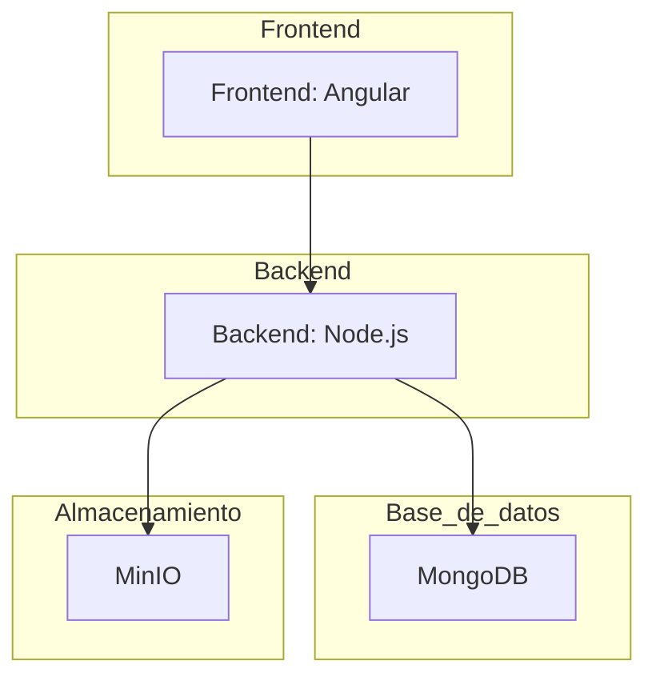

# Crud
Este es un crud de peliculas simple, para demostrar conceptos como:

Base de datos no relacional (MongoDb)

Almacen de archivos (Minio)

Backend (NodeJs)

Frontend (Angular)

Api

Test

## Diagrama


## Descargue el repositorio y ejecute

Previamente debe de tener instalado docker

```
docker-compose up
```